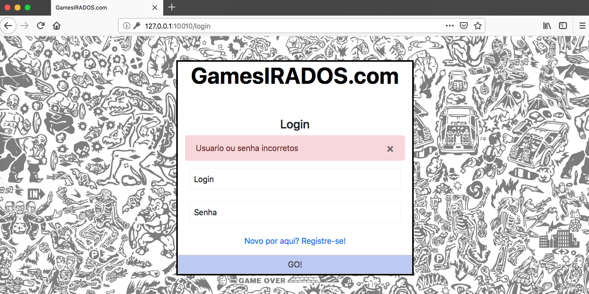
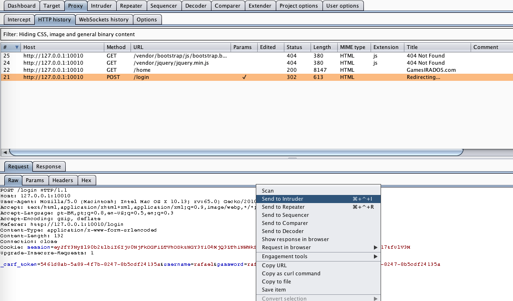
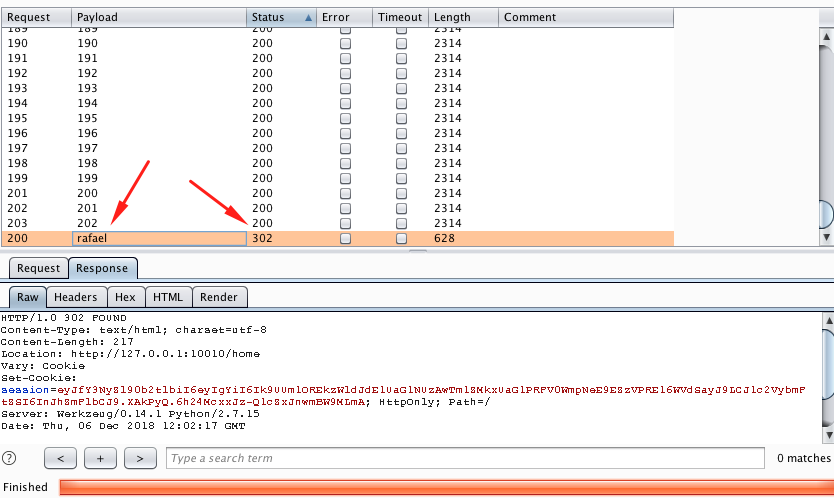
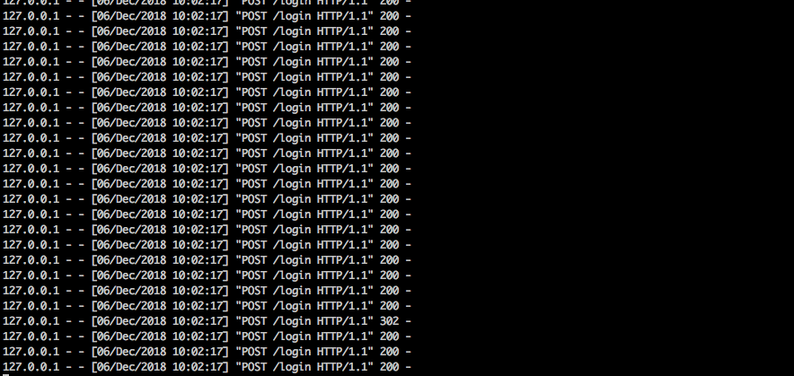

# Games Irados

[Access content in English](README.md)

<p align="center">
    
</p>

Games Irados é uma aplicação web simples em Python que contém um exemplo de vulnerabilidade de falha de registro e monitoramento de segurança e, seu principal objetivo é demonstrar o quão importante é registrar corretamente todas as solicitações feitas ao aplicativo e com que facilidade solicitações maliciosas podem passar despercebidas. 

## Index

- [Definição](#O-que-é-falha-de-registro-e-monitoramento-de-segurança)
- [Como inicializar o aplicativo?](#como-inicializar-o-aplicativo)
- [Narrativa de ataque](#narrativa-de-ataque)
- [Objetivos](#proteger-este-aplicativo)
- [Soluções](#pr-soluções)
- [Contribuição](#contribuição)


## O que é falha de registro e monitoramento de segurança?

A falha de registro e monitoramento de segurança, juntamente com a integração ausente ou ineficaz com a resposta a incidentes, permite que os invasores ataquem ainda mais os sistemas, mantenham a persistência, mudem para mais sistemas e adulterem, extraiam ou destruam dados. A maioria dos estudos de violação mostra que o tempo para detectar uma violação é superior a 200 dias, normalmente detectado por partes externas em vez de processos internos ou monitoramento. 

O objetivo principal deste aplicativo é discutir como as vulnerabilidades **falha de registro e monitoramento de segurança** podem ser exploradas e encorajar os desenvolvedores a enviar solicitações pull do secDevLabs sobre como mitigar essas falhas. 

## Como inicializar o aplicativo?

Para iniciar este **aplicativo inseguro** intencionalmente, você precisará do [Docker][Docker Install] e do [Docker Compose][Docker Compose Install]. Depois de clonar o repositório [secDevLabs](https://github.com/globocom/secDevLabs), no seu computador, você deve digitar os seguintes comandos para iniciar o aplicativo:

```sh
cd secDevLabs/owasp-top10-2021-apps/a9/games-irados
```

```sh
make install
```

Depois é só visitar  [localhost:10010][app] ! 😆

## Conheça o app 🎮

Para entender corretamente como esse aplicativo funciona, você pode seguir estes passos simples:

- Criar um novo usuário!
- Confira todos os jogos oferecidos!
- Tente resgatar um cupom de jogo após o login!

## Narrativa de ataque

Agora que você conhece o propósito deste aplicativo, o que pode dar errado? A seção a seguir descreve como um invasor pode identificar e, eventualmente, encontrar informações confidenciais sobre o aplicativo ou seus usuários. Recomendamos que você siga estas etapas e tente reproduzi-las por conta própria para entender melhor o ataque! 😜

### 👀

#### Um log de aplicativo ruim pode mascarar solicitações maliciosas feitas ao servidor

Para verificar como um aplicativo trata eventos considerados maliciosos, dois ataques serão feitos para testá-lo:

- Força bruta a tela de login
- Força bruta a tela de validação do cupom

Inicialmente, iniciamos o primeiro ataque enviando uma tentativa de login intencionalmente errada, conforme mostra a imagem abaixo:

<p align="center">
    
</p>

## 🔥

Depois disso, um invasor pode usar o [Burp Suite] como proxy para enviar quantas solicitações forem necessárias até que uma senha válida seja encontrada (se precisar de ajuda para configurar seu proxy, consulte este [guia](https:// support.portswigger.net/customer/portal/articles/1783066-configuring-firefox-to-work-with-burp)). Para isso, após encontrar a solicitação POST de login, clique com o botão direito e envie para `Intruder`, conforme mostrado abaixo: 

<p align="center">
    
</p>

Na aba `Positions §`, todos os campos devem ser limpos primeiro através do botão `Clear §`. Para configurar `password` para mudar de acordo com cada senha da nossa lista de palavras do dicionário, basta clicar no botão `Add §` após selecioná-lo:

<p align="center">
    
</p>

Caso seja encontrada uma senha válida, o aplicativo pode processar novos cookies e eventualmente redirecionar o fluxo para outras páginas. Para garantir que o ataque de força bruta siga este comportamento, defina `Always` nas opções `Follow Redirections` na aba `Options`, conforme mostrado abaixo: 

<p align="center">
    
</p>

Você pode usar a seguinte lista de palavras (`poc.txt`) apenas para fins de POC:

```
admin
password
123
qweasd
1qaz
123456789
flamengo
zxc
asd123qwe
YOURVALIDPASSWORD
```

Antes de executar o ataque, você pode abrir uma nova aba em seu terminal e digitar o seguinte comando para observar como as solicitações maliciosas chegarão ao app: 

```sh
docker logs app-a10 -f
```

Na aba `Payloads`, basta escolher a lista de palavras da opção `Load...` e então o ataque pode ser realizado através do botão `Start attack`.

<p align="center">
    
</p>

Como podemos ver pelos resultados das solicitações, o aplicativo trata solicitações bem-sucedidas e malsucedidas de maneira diferente, respondendo a códigos de status diferentes. Conforme mostrado abaixo, quando o payload está correto, o aplicativo responde um código de status `302 FOUND`, caso contrário, ele responde com um `200 OK`. 

<p align="center">
    
</p>

Ao dar uma olhada na aplicação do lado do servidor, é possível ver que os logs fornecem poucas informações sobre o ataque, conforme mostrado abaixo: 

<p align="center">
    
</p>

Além disso, se tentarmos a rota `/coupon`, em vez do `/login`, podemos ver resultados semelhantes. A página do cupom é mostrada abaixo:

<p align="center">
    
</p>

Usando o Burp Suite novamente, poderíamos enviar várias solicitações para o aplicativo para simular o segundo ataque de força bruta, alterando apenas o campo `cupom`:

<p align="center">
    
</p>

Se você precisar gerar uma lista de palavras numéricas simples, você pode usar o seguinte comando:

```sh
seq 100 200 > coupons.txt
```

Como podemos ver na imagem abaixo, as solicitações parecem ter sido tratadas corretamente pelo servidor.

<p align="center">
    
</p>

No entanto, também podemos confirmar que poucas informações estão sendo registradas no lado do servidor, conforme mostra a imagem abaixo:

<p align="center">
    
</p>

## Proteger este aplicativo

Como você arrumaria essa vulnerabilidade? Após suas alterações, um invasor não poderá:

- Descobrir quem fez o pedido
- Descobrir o que aconteceu
- Descobrir quando aconteceu
- Descobrir onde aconteceu

## PR Soluções

[Alerta de spoiler 🚨 ] Para entender como essa vulnerabilidade pode ser resolvida, confira [these pull requests](https://github.com/globocom/secDevLabs/pulls?q=is%3Apr+label%3A%22mitigation+solution+%F0%9F%94%92%22+label%3AGamesIrados.com)!

## Contribuição

Nós encorajamos você a contribuir com o SecDevLabs! Por favor, confira a seção [Contribuição no SecDevLabs](../../../docs/CONTRIBUTING.md) de como fazer a sua contribuição!🎉 🎉

[docker install]: https://docs.docker.com/install/
[docker compose install]: https://docs.docker.com/compose/install/
[app]: http://localhost:10010
[secdevlabs]: https://github.com/globocom/secDevLabs
[2]: https://github.com/globocom/secDevLabs/tree/master/owasp-top10-2021-apps/a9/games-irados
[burp suite]: https://portswigger.net/burp
